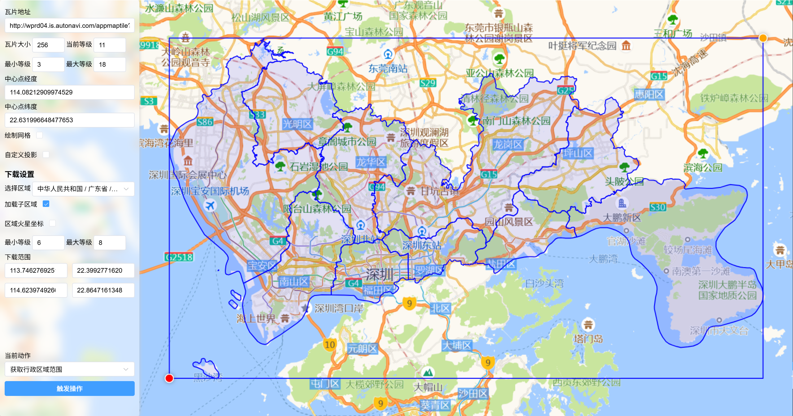
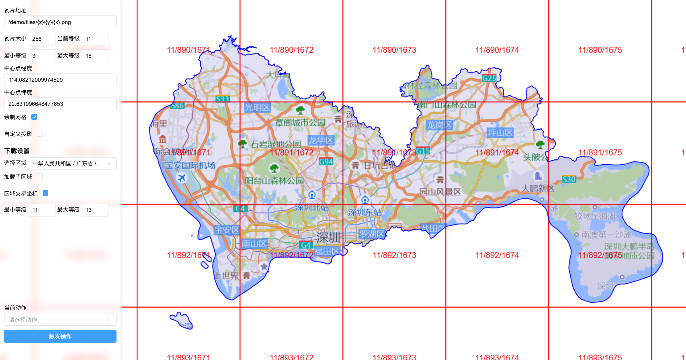

# 不用钱！纯前端离线瓦片地图下载

详细代码讲解请看掘金博客

## 功能

- [x] 导入导出配置
- [x] 手动绘制范围
- [x] 获取当前地图范围
- [x] 绘制行政区域,获取行政区域范围
- [x] 自定义投影，投影配置，原点，lods配置
- [x] 下载地图瓦片，分包下载地图瓦片
- [x] 下载当前截图
- [x] 下载行政区图
- [x] 下载行政区域瓦片
- [ ] 拆分下载大缩放层级行政区域瓦片
- [x] 导入geojson并绘制
- [ ] 自定义GeoJson数据转瓦片底图
- [ ] 瓦片转换坐标系

**参考**

- jszip-https://stuk.github.io/jszip/
- leaflet- https://github.com/Leaflet/Leaflet
- proj4-https://proj4js.org/
- proj4leaflet-https://kartena.github.io/Proj4Leaflet/
- 天地图-https://www.tianditu.gov.cn/
- 高德地图-https://lbs.amap.com/api/javascript-api-v2/summary
